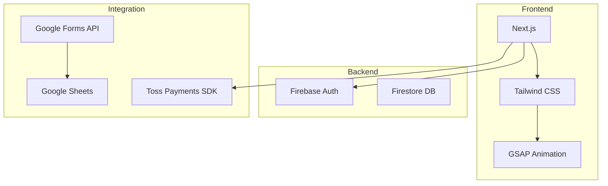

# [PRD] singlepick.space: 마케팅 가이드 구독 서비스 구축

> **버전**: 1.0  
> **상태**: 기획 확정 및 개발 준비  
> **담당자**: 프로젝트 총괄 (대표)  
> **최종 업데이트**: 2026-01-13

---

## 1. 프로젝트 개요 (Project Overview)

### 1.1 목적 (Goals)

| 목표 | 설명 |
|------|------|
| **리드 확보** | 무료 질문권을 통한 잠재 고객 데이터베이스 구축 |
| **수익화** | 실전 경험 기반의 유료 마케팅 진단 및 컨설팅 서비스 판매 |
| **브랜드 구축** | '왕쉬운 경제학' 인사이트를 바탕으로 한 '실전 유통 전문가'로서의 포지셔닝 |

### 1.2 배경 (Background)

- AI와 마케팅 정보의 홍수로 인해 정보는 많으나 **'내 사업에 맞는 정답'을 판단하기 어려운 시장 상황**
- 단순 이론이 아닌, **2년 만에 40억 매출을 달성한 실전가의 '판단력'**을 서비스로 제공하고자 함

### 1.3 타겟 오디언스 (Target Audience)

| 구분 | 대상 |
|------|------|
| **Primary** | 제품/서비스를 보유한 개인 사업자 및 중소기업 대표 |
| **Constraint** | 현업에 종사하지 않는 자(취준생, 퇴사자 등)는 서비스 대상에서 제외 |

---

## 2. 핵심 메시지 및 사용자 가치 (Key Message & Value)

### 핵심 슬로건
> **"마케팅은 쉽습니다. 연결할 다리(Bridge)가 없을 뿐입니다."**

### 차별화 요소 (USP)

1. **전문가 직접 진단**: AI가 아닌 10년 차 유통 전문가의 직접 진단
2. **단일 실행안**: 방대한 전략 대신 '지금 당장 해야 할 단 하나'의 실행안 제공
3. **역할 분리**: 설계자(전문가)와 시공자(대표)의 명확한 역할 분리

---

## 3. 기능 요구사항 (Functional Requirements)

### 3.1 사용자 인증 (Authentication)

| ID | 기능 | 설명 |
|----|------|------|
| F01 | 구글 소셜 로그인 | 서비스 신청 및 결제를 위한 최소한의 인증 절차 |

### 3.2 상담 및 리드 생성 (Lead Generation)

| ID | 기능 | 설명 |
|----|------|------|
| F02 | 무료 질문 기능 | 1회 한정 텍스트 답변 신청 기능 |
| F03 | 구글 폼 연동 | 신청하기 클릭 시 상세 설문(제품, 가격, 매출 등) 작성 페이지 연결 |
| F04 | 데이터 자동 적재 | 설문 완료 시 구글 스프레드시트에 실시간 데이터 저장 |

### 3.3 결제 시스템 (Payment)

| ID | 기능 | 설명 |
|----|------|------|
| F05 | 토스 페이먼츠 연동 | Pricing 섹션의 유료 서비스(5만 원~500만 원) 결제 처리 |

### 3.4 콘텐츠 관리 (Content)

| ID | 기능 | 설명 |
|----|------|------|
| F06 | 반응형 랜딩 페이지 | PC/모바일 최적화된 마케팅 페이지 |
| F07 | 외부 채널 연결 | 유튜브('왕쉬운 경제학'), 인스타그램 링크 연동 |

---

## 4. 정보 구조 (Information Architecture)

| 대메뉴 | 소메뉴/섹션 | 주요 내용 |
|--------|-------------|-----------|
| **Home** | Landing Section | 제품-고객-다리 메타포, 40억 매출 실적 강조 |
| **About Us** | Philosophy | 등대 비유, 조리 도구 vs 요리사, 설계자 vs 시공자 철학 |
| **Pricing** | Plan Table | 무료 / 5만 원 / 50만 원 / 500만 원 플랜 및 혜택 기술 |
| **Contact** | Channel | 이메일, 유튜브, 인스타그램 연락처 정보 |

---

## 5. 디자인 및 UX (Design & UI/UX)

### 5.1 컨셉: "Chaos to Order" (혼돈에서 질서로)

| 요소 | 설명 |
|------|------|
| **비주얼** | 다크 모드 배경을 기본으로 하여 전문성과 몰입감 부여 |
| **포인트 컬러** | 네온 블루(통찰), 앰버 골드(성공/등대 빛) |
| **인터랙션** | GSAP를 활용하여 스크롤 시 복잡한 정보 텍스트들이 정리되며 하나의 명확한 가이드라인으로 합쳐지는 애니메이션 구현 |

### 5.2 톤앤매너

- **냉철함**: 데이터와 경험에 기반한 전문가적 시선
- **명확함**: 수식어 없는 직설적인 해결책 제시

---

## 6. 기술 사양 (Technical Specifications)

| 영역 | 기술 | 목적 |
|------|------|------|
| **Frontend** | Next.js | SEO 및 빠른 로딩 속도 최적화 |
| **Styling** | Tailwind CSS | 반응형 대응 및 다크 모드 구현 |
| **Backend** | Firebase | 구글 로그인 및 기본 유저 데이터 관리 |
| **Integration** | Google Forms API / Apps Script | 데이터 전송 자동화 |
| **Integration** | Toss Payments SDK | 결제 연동 |

---

## 7. 예산 및 제약 사항 (Constraints)

### 운영 제약
- 유료 서비스별 **인원 한정** (매일 3자리, 매월 10명 등) 시스템적 노출 필요

### 서비스 범위
- **실행(광고 세팅 등)은 포함되지 않음**
- **'설계/진단'에 집중**

---

## 8. Pricing 플랜 상세

| 플랜 | 가격 | 대상 | 혜택 |
|------|------|------|------|
| **무료** | 0원 | 첫 방문 고객 | 1회 무료 질문권 (텍스트 답변) |
| **기본** | 5만 원 | 간단한 진단 필요 | 1:1 텍스트 진단 |
| **프리미엄** | 50만 원 | 심층 분석 필요 | 상세 마케팅 진단 리포트 |
| **VIP** | 500만 원 | 전략 수립 필요 | 종합 컨설팅 패키지 |

---

*본 문서는 프로젝트 진행에 따라 업데이트됩니다.*
